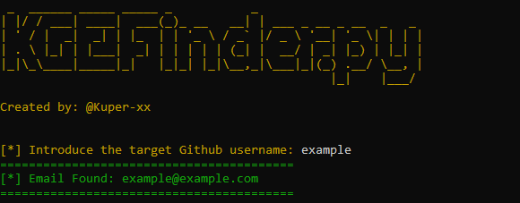

<h1 align="center">
  
  <br>
</h1>

<p align="center">
  <a href="#explanation">Explanation</a> •
  <a href="#installation">Installation</a> •
  <a href="#usage">Usage</a> •
  <a href="#contributing">Contributing</a>
</p>

## Explanation
KGEFinder.py is a Python tool designed to find the email address from the commits of a given GitHub user. Here’s a brief explanation of how it works:

Get Repositories: It fetches all repositories of the given GitHub username.
Get Commits: For each repository, it retrieves the list of commits.
Check Commit Verification: It checks if the commit is verified.
Extract Email: If a commit is not verified, it fetches the commit in .patch format and extracts the email address of the committer.

## Installation

To use KGEFinder.py, you need to have Python installed on your system. Additionally, you need to install the required Python libraries. Follow the steps below to get started:

Clone the repository and enter to the folder:
   ```sh
   git clone https://github.com/Kuper-xx/KGEFinder.git
   cd KGEFinder
   ```

## Usage

To run KGEFinder.py, use the following command:
```sh
python KGEFinder.py
```
Then you just have to put the github username target:
<h1 align="center">
  
</h1>

## Contributing
If you would like to contribute to this project, please fork the repository and submit a pull request. For major changes, please open an issue first to discuss what you would like to change.

© Created by Kuper-xx - feel free to contact me!
